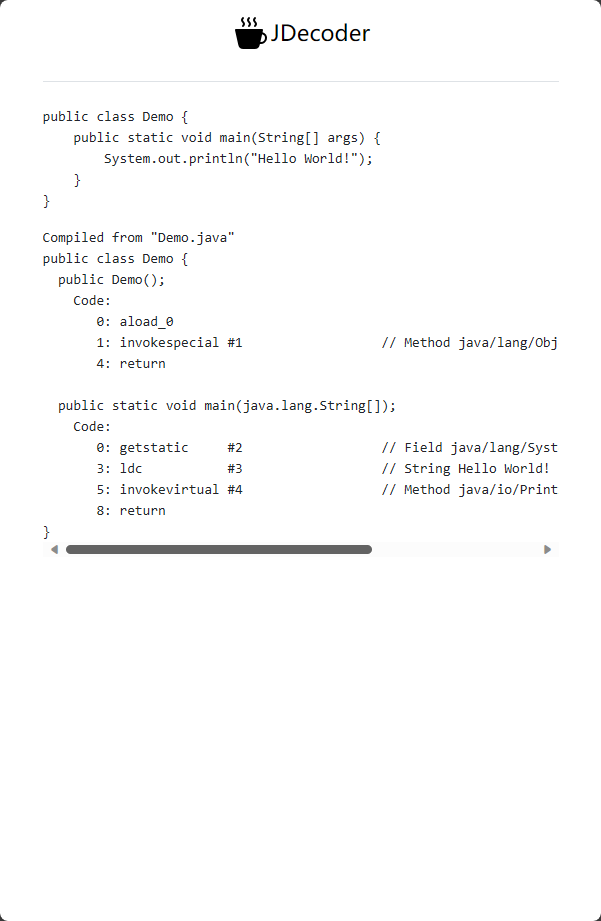

Online JDecoder
===============

Online view java byte-code. Put the java snippet, and get the byte-code online. 
To help you learn java byte-code on everywhere.

```java
class Data {
    private String message;

    public String getMessage() {
        return this.message;
    }

    public String setMessage(String message) {
        this.message = message;
    }
}

public class Demo {
    public static void main(String[] args) {
        Data data = new Data();
        data.setMessage("Hello, World!");
        System.out.println(data);
    }
}
```

<div style="display: flex">
<div style="margin: 10px"></div>
<div style="margin: 10px"></div>
</div>


