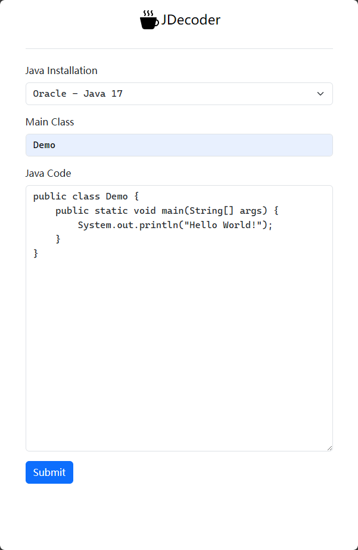

Online JDecoder
===============

Online view java byte-code. Put the java snippet, and get the byte-code online. 
To help you learn java byte-code on everywhere.

```java
public class Demo {
    public static void main(String[] args) {
        System.out.println("Hello World!");
    }
}
```

<div style="display: flex">
<div style="margin: 10px"></div>
<div style="margin: 10px"></div>
</div>


